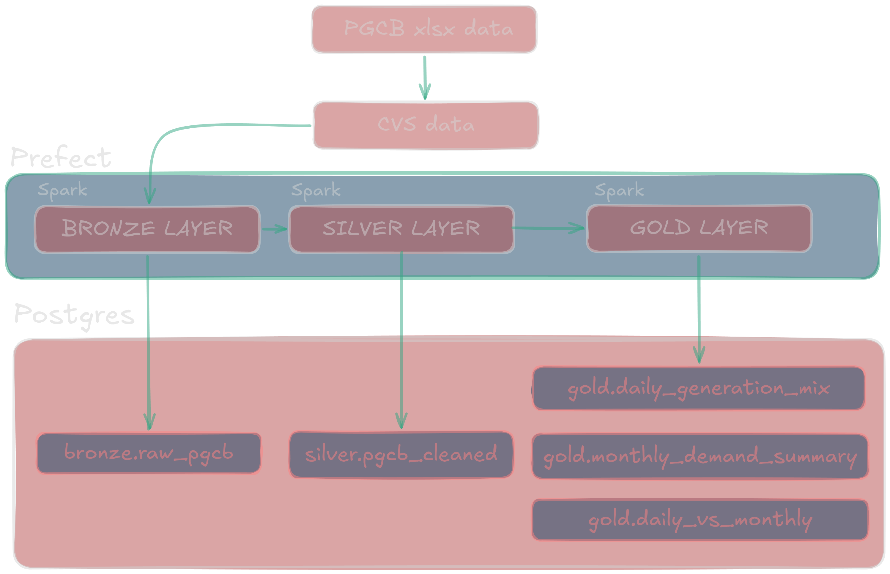

# PGCB Power Grid ELT Pipeline

Ingests Bangladesh's national grid telemetry (hourly generation, demand, and load-shedding data from the Power Grid Company of Bangladesh) into PostgreSQL via a bronze -> silver -> gold medallion architecture.



## Prerequisites

- [Docker](https://docs.docker.com/get-docker/) / [Podman](https://podman.io/getting-started/installation) with `docker compose` available
- Python 3.13 with `uv` (`nix develop` or activate the `.venv`)
- `data/PGCB_date_power_demand.xlsx` placed in the `data/` directory
  - https://doi.org/10.24432/C59P6V

## Quick Start

### Spark pipeline
```bash
just load-csv # Prepare the CSV from the xlsx file
just up # Start Postgres
just spark-pipeline # Run the pipeline
jsut inspect-tbl # Inspect the row counts of the tables
just down # Stop Postgres
```

### Pure SQL
```bash
just load-csv # Prepare the CSV from the xlsx file
just up # Start Postgres
just pipeline # Run the pipeline
jsut inspect-tbl # Inspect the row counts of the tables
just down # Stop Postgres
```

## Just Recipes

| Command           | Description                                         |
|-------------------|-----------------------------------------------------|
| `just up`         | Start PostgreSQL and wait for it to be ready        |
| `just down`       | Stop and remove the PostgreSQL container             |
| `just load-csv`   | Convert the xlsx file to CSV (bronze step 1 of 2)  |
| `just ingest-bronze` | Load the CSV into `bronze.raw_pgcb`           |
| `just silver`     | Clean and type-cast data into `silver.pgcb_cleaned` |
| `just gold`       | Build analytical tables in `gold` schema            |
| `just pipeline`   | Full end-to-end: `up` + ingest + silver + gold      |
| `just repl`       | Open an interactive `psql` session                  |

## Schema Overview

```
bronze.raw_pgcb           <- raw, as-loaded from xlsx (all TEXT)
  silver.pgcb_cleaned     <- typed, nan->NULL, indexed by datetime
    gold.daily_generation_mix       <- daily MWh per generation source
    gold.monthly_demand_summary     <- monthly demand/load-shedding stats
    gold.daily_vs_monthly           <- daily x monthly JOIN (anomaly context)
```

## Stopping

```bash
just down
```
